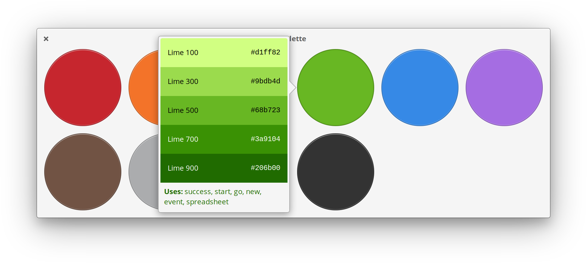

  

<h1 align="center">Palette</h1>

  

## View and copy colors from the elementary brand palette

elementary uses a set of bright and friendly colors. Easily access the entire palette on your local device, plus copy any variation of each color to paste into your own projects.

## Made for [elementary OS](https://elementary.io)

Palette is designed and developed on and for [elementary OS](https://elementary.io). Purchasing through AppCenter directly supports the development and ensures instant updates straight from me. Get it on AppCenter for the best experience.

## Developing and Building

If you want to hack on and build Palette yourself, you'll need the following dependencies:

* libgee-0.8-dev
* libgtk-3-dev
* meson
* valac

Run `meson build` to configure the build environment and run `ninja test` to build and run automated tests

    meson build --prefix=/usr
    cd build
    ninja test

To install, use `ninja install`, then execute with `com.github.cassidyjames.palette`

    sudo ninja install
    com.github.cassidyjames.palette

## Other Platforms

Palette is made for elementary OS, but may have been built and made available elsewhere by community members. These builds may have modifications or changes and **are not provided or supported by me**.

## Special Thanks

- [Micah Ilbery](https://github.com/micahilbery) for the shiny icons
- [Daniel Foré](https://github.com/danrabbit) for his apps to use as code examples

-----

